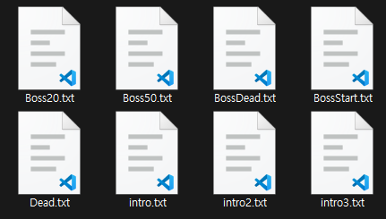
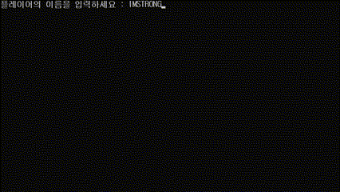
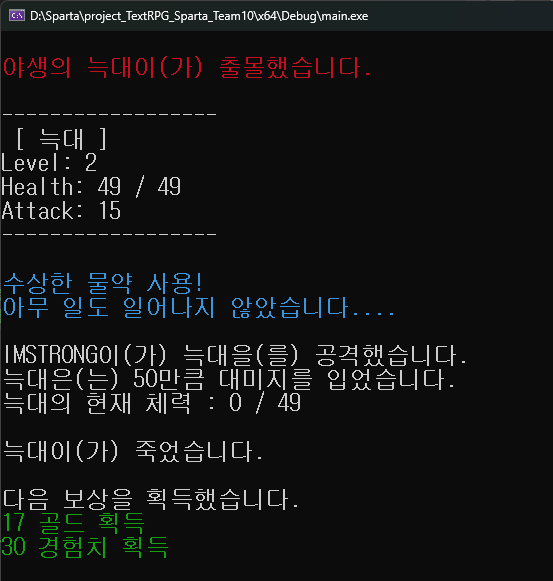

# Sparta Team 10's Project 

### 📌Topic

팀원과 협업하여 Text RPG 를 제작해 보자!


### 📌발표자료

[PDF URL](https://github.com/Qussong/project_TextRPG_Sparta_Team10/blob/main/Text%20RPG%2010%EC%A1%B0.pdf)

### 📌팀 구성 및 역할

|이름|직책|역할|
|---|---|---|
|오상민|팀장|몬스터, 스토리|
|김기훈|부팀장|게임 매니저, 파일 매니저, 상점, 아이템, 깃 브랜치|
|강준희|팀원|몬스터|
|문정수|팀원|캐릭터|
|김연준|팀원|캐릭터|

### 📌기능구현_Essential

UML 다이어그램 클래스 기능 구현
<!--

-->

### 📌기능구현_Challenge

**🔻File I/O**

파일 입출력을 활용한 스토리 출력 기능을 구현했습니다.<br>
장문의 텍스트를 소스 코드 내에 직접 작성하면 코드 관리가 어려워지고, 기능 구현 과정에서 불편함이 발생할 수 있습니다.<br>
이를 해결하기 위해 스토리 내용을 별도의 텍스트 파일에 작성한 뒤, 파일 입출력을 통해 해당 내용을 읽어와 콘솔 화면에 출력하도록 설계했습니다.<br>   



```cpp
bool FileReaderManager::OpenFile(std::wstring filePath)
{
	readFile.open(filePath);
	if (false == readFile.is_open())
	{
		std::cout << "Failed to open file for reading!" << std::endl;
		return false;
	}
	ReadFile();
	return true;
}

void FileReaderManager::ReadFile()
{
	std::wstring line;
	bool bEnd = false;
	while (false == bEnd)
	{
		if (std::getline(instance->readFile, line))
		{
			lineContainer.push_back(line);
			
			if (readFile.eof())
				bEnd = true;

			if (readFile.fail()) 
			{
				std::cerr << "An error occurred while reading the file!" << std::endl;
				bEnd = true;
			}
		}
	}
}
```

**🔻Typing Effect**

스토리 출력 시, 시각적 완성도를 높이기 위해 타이핑 효과를 구현했습니다.<br>
입출력 버퍼를 활용하여 텍스트가 한 글자씩 화면에 나타나도록 처리함으로써, 실제로 타이핑을 치는 듯한 생동감 있는 연출을 추가했습니다.<br> 
이를 통해 단순한 텍스트 출력보다 더욱 몰입감 있는 사용자 경험을 제공할 수 있습니다.<br>



```cpp
void FileReaderManager::typingEffect(const std::wstring& text, int delay)
{
	for (wchar_t ch : text) {
		std::wcout << ch << std::flush; // flush를 사용하여 즉각 출력
		std::this_thread::sleep_for(std::chrono::milliseconds(delay)); // 딜레이
	}
}
```

**🔻Console Color Change**

시각적 구분을 명확하게 하기 위해 콘솔 출력 시 텍스트의 색상을 변경하는 기능을 구현했습니다.<br>
각기 다른 종류의 텍스트에 색상을 달리 적용함으로써, 사용자에게 보다 직관적이고 가독성 좋은 정보를 제공할 수 있게 되었습니다.<br> 
이를 통해 스토리 진행 상황이나 중요 메시지를 효과적으로 강조할 수 있습니다.<br>



```cpp
static void setConsoleColor(int color) 
{
    HANDLE hConsole = GetStdHandle(STD_OUTPUT_HANDLE); // 콘솔 핸들 가져오기
    SetConsoleTextAttribute(hConsole, color);          // 색상 설정
}
```

### 📌사용 환경 및 툴

- OS : Windows
- Language : Visual C++ 2022
- IDE : Microsoft Visual Studio Community 2022 (64-bit) Version 17.9.7
- Collab Tool : Notion ( [_Notion URL_](https://www.notion.so/teamsparta/2-1762dc3ef51481579ebef032d9cbeeb0) ), Discord, Zep
